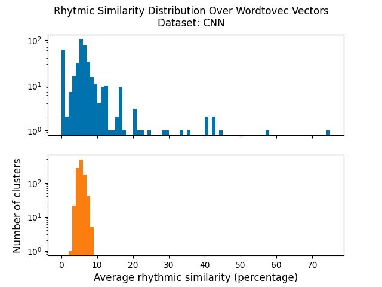

#Can Word Embeddings Capture Rhytmic Similarity of Words?

**Not as well as semantic similarites, but yes!**

This is a Python project developed to examine various Word Embedding systems on different corpora, to verify if they are able to capture the rhytmic similarity of the words or not? We hope the result will be published in a scientific paper in the near future.

### What is rhytmic similarity (RS)?
For the purpose of this project, we define two given words as rhytmically similar, if they are said (pronounced) with similar sounds, specially at their ending or beginning. For example, the words 'doom' and 'gloom' have rhytmic similarity because they both are ended with the sound: /uːm/, another example is 'Cheese' and 'peas' (taken from [BBC](https://www.bbc.co.uk/bitesize/topics/zjhhvcw/articles/zqjgrdm)). Even words like 'tend' and 'tell' are rhyming words, to a lesser degree though.

### How to measure RS?
Having said that there are degrees in RS, it raises the question about how can we measure these degrees? Indeed, we need a formula, that takes two words as input, and returns a number (say between 0 to 1) reflecting the degree of similarity between them. Throughout this project, we will do it in a couple of ways. But in its simplest form, we count the similar letters in the same positions of words, and divide it by the length of the longer one. More details would be explained in the paper and the demo site soon.

### Are word embeddings just for semantics?
So far, we've heard every where and there that word embeddings are good at capturing semantic similarity. This means, to some extent, that if we cluster words, based on the proximity of thier vectors in the embedded space, words with similar meaning tend to fall in the same clusters. Now, in this work, we are going to investigate something alike, but in terms of rhymes and assonances rather than semantics. More precisely, we are supposed to investigate this hypothesis: "If we cluster words of a corpus based on their embedded vectors, words inside each cluster have more rhytmic similarity to each other".

### What have we done so far?
We grasped a corpus of formal news from CNN and generated word vectors with Word2Vec. Then using KMeans we clustered vectors into 1000 clusters. For each cluster, we measured average RS (AvRS) of all word pairs in it. We observed that obtained AvRS's are substantially higher compared to the time we cluster words randomly. In the chart below, the blue bars show the number of clusters in each range of AvRS. While the orange ones, show the same for random clusters. 


As you can see, none of random clusters have had AvRS grater than 10%. Whilst Word2Vec clusters, are more distributed over the range 5% to 50%.

### You want to reproduce our result?
Fair enough! Just go to the folder input and create a folder there similar to the sample folder, containing a raw.txt file which is your corpus. Then run the main.py.

```
cp -r input/sample input/myown_dataset
```
Then collect your corpus text and put in in the input/myown_dataset/raw.txt with the same foramt as in input/sample/raw.txt
```
pip install -r requirements.txt
python3 main.py
```

When finished, appropriate charts are stored in the output folder.

### Still in progress!
There's a lot to do on this project, specially on documentation. We're actively working on it. Check this page in the next coming weeks, please!